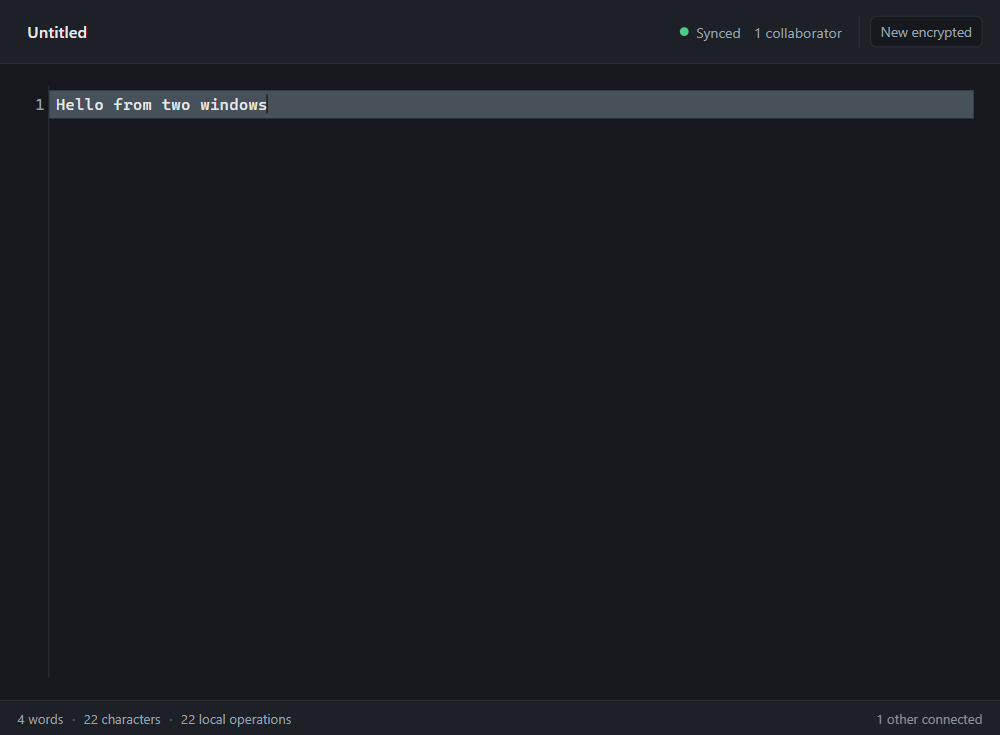
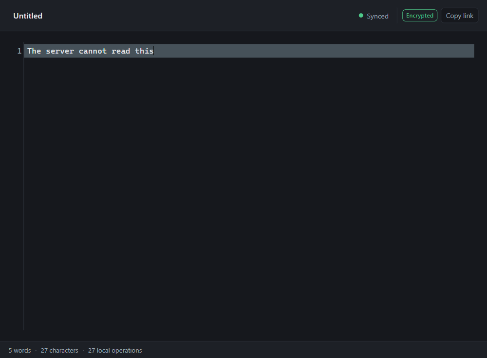

# collab-editor

## A complete guide to how it works, and why it is built this way

---

## How to read this document

This is meant to be read in order the first time, and dipped into afterwards.

- **Part 1** has no jargon. It explains what the product does and why it exists. If you stop
  after Part 2 you will still know how to use it and what problem it solves.
- **Part 2** is the mechanics, from zero. Every concept is defined before it is used.
- **Part 3** is the deep end: the CRDT, the protocol, the compaction, the cryptography.
- **Part 4** is the engineering around the product: testing, CI, deployment.
- **Part 5** is reference: decisions, limits, glossary.

Two conventions run throughout.

**Claims are labelled.** Where something is _measured_, the number is stated. Where it is
_argued_, it is argued. Where it is _unverified_, it says so. This matters more than it
sounds: a document that mixes the three is impossible to trust selectively.

**Code is real.** Every snippet is copied from the repository and still compiles. Where a
snippet has been shortened, it is marked, because a tidied-up excerpt teaches the wrong thing.

---

<!-- toc -->

# Part 1 — The product

## 1.1 What it is

A collaborative text editor that runs in a browser. Two or more people open the same link and
type in the same document at the same time, and the text stays consistent.

Three properties distinguish it from a web form with a save button:

1. **It keeps working when the network does not.** Close your laptop, fly somewhere, open it
   again. Your edits are still there and they synchronise when you reconnect.
2. **It never asks you to resolve a conflict.** There is no "these two people changed the same
   line" dialog, because there is no ambiguity to resolve.
3. **It can be end-to-end encrypted.** For a document you mark as encrypted, the server stores
   ciphertext. It cannot read the contents, because it never receives the key.

## 1.2 The problem it solves

The naive way to build collaborative editing is a shared document on a server. That works until
one of three things happens:

- **Two people type at once.** The server has to decide who wins. Now you have lost data, and
  the loser does not know they lost anything.
- **Someone goes offline.** Their edits have nowhere to go. When they come back, the server
  asks them to reconcile two versions by hand.
- **The connection is slow.** Every keystroke makes a round trip, so the editor lags, so people
  batch their typing, so the merge is bigger and harder.

The underlying difficulty is that a network partition makes "what is the document?" genuinely
ambiguous. Two replicas that have not spoken cannot know what the other did.

The two established answers are:

| Approach                                | How it resolves ambiguity                                                                                                            | Cost                                                                           |
| --------------------------------------- | ------------------------------------------------------------------------------------------------------------------------------------ | ------------------------------------------------------------------------------ |
| **Operational transformation**          | A central server transforms each operation against the operations it has already seen, so every replica ends up with the same result | Needs the server for every keystroke. Slow, and offline is close to impossible |
| **Conflict-free replicated data types** | Give every element a globally unique identity and a defined position, so merging is pure set union — no coordination, ever           | The data model is unusual, and the merge logic is genuinely hard to get right  |

This project takes the second path.

> **A CRDT is a data structure where merging two copies is guaranteed to produce the same
> result on both, without either copy asking the other what happened.**

"Conflict-free" is not a claim of quality. It means the _merge_ cannot conflict. It says nothing
about whether the merged result is what a human wanted.

## 1.3 What it is not

Being clear about this early saves confusion later.

- **Not a Google Docs replacement.** No comments, no suggestions, no track changes, no
  formatting, no sharing dialog, no comments, no version history.
- **Not multi-user across browsers.** A document belongs to the browser profile that created
  it. A second browser is a different anonymous person and gets a 404. There is no sharing
  mechanism yet. This is the single largest gap.
- **Not a single-machine demo.** The server is real: it persists, relays, and enforces access.
  It is also single-instance, because fan-out between instances is in-process.

## 1.4 Run it

```bash
npm install
npm run start:local
```

That prints a URL. Open it. Then open the same URL in a second window, side by side, and type
in both.

To see it properly, follow `docs/TESTING.md`, which walks through every feature by hand.

---

# Part 2 — The mechanics

## 2.1 The one rule everything else follows

> **The device is authoritative. The server is a synchronisation optimisation.**

This single decision explains most of the design, so it is worth being precise about what it
means.

The document is not "a row in a database with a text column". The document is **the log of
operations that produced it**. Any replica can rebuild the document by replaying that log.

The server holds the log. It does not decide what the log contains, does not merge, does not
rewrite, and does not resolve conflicts — because the merge algorithm runs on the clients, and
it cannot conflict.

If the server disappears, every client keeps working. When it returns, clients catch it up.
That is not resilience bolted on afterwards; it is the direction the data flows.

## 2.2 The pieces

```bash
src/
  core/      the CRDT and the crypto. No I/O, no browser, no server. Pure logic.
  shared/    things both sides must agree on: wire types, validation, identity rules.
  client/    the browser app: editor, transport, local storage, UI.
  server/    HTTP API, WebSocket relay, database, observability.
```

The dependency rule is one-way:

```
core  <-  shared  <-  client
                  <-  server
```

`core` imports nothing from `client` or `server`. That is what makes the CRDT testable
without a browser, a server, or a network — and it is why the test suite can run in seconds.

## 2.3 What a character actually is

This is the idea the whole system rests on, so it is worth stating slowly.

A text document is not stored as a string. It is stored as an **ordered list of elements**, one
per character, and every element has three things:

- a **value** — the character itself
- an **id** — a `(site, clock)` pair, unique across the entire system
- an **origin** — the id of the element it was typed _after_

Typing `H` at the very start of an empty document creates one element: value `H`, a brand-new
id, and origin `null` (meaning "the beginning of the document").

Typing `i` straight after it creates an element with value `i`, a new id, and origin _the id of
the `H` element_.



_Two windows on the same document. Both show the same 22 characters, both report 22 local
operations, and both see one collaborator. This is the state the rest of this document explains
how to reach._

## 2.4 Why an origin is enough

Suppose the document is `H i` and someone deletes the `H`. What remains is `i`, whose origin
points at an element that no longer exists.

If we deleted elements outright, `i` would be an orphan. Two replicas could then disagree about
what comes before it, and there would be nothing left to compare. So **elements are never
removed**. A delete marks the element as a tombstone: it stays in the log, keeps its id, and
stops contributing a character to the rendered text.

That single choice is what makes deletion order-independent. Whether a delete arrives before
or after the insert it targets, the outcome is identical — which is exactly the property a
CRDT needs.

## 2.5 Merging is set union

Because every element has a globally unique id, and every element knows what it comes after,
the merge of two documents is:

1. Take all elements from both sides.
2. Discard any whose id you already have.
3. Order them by their origin chain.

There is no conflict to resolve, because ids cannot collide and the ordering rule is total.
That is the entire trick. `isGreaterId` in `src/core/crdt/rga.ts` breaks the tie when two
elements share an origin, using `(site, clock)` — and because a site is a random UUID per
replica, two replicas essentially never produce the same id by accident.

> **A note on clocks.** Each replica keeps a counter. When it sees an operation from another
> replica with a higher counter, it raises its own counter to match — a _Lamport clock_. This
> is what guarantees ids are never reused within a replica, which would otherwise silently
> corrupt the document.

## 2.6 Where a character is created

The editor is CodeMirror 6. It reports changes as positions and text. Turning that into CRDT
elements is the binding's job, in `src/client/sync/binding.ts`:

```typescript
exportLocalChanges(changes: ChangeSet): Operation[] {
  if (this.#reflecting || this.#detached) {
    return [];
  }

  const edits: LocalEdit[] = [];

  changes.iterChanges((fromBefore, toBefore, _fromAfter, _toAfter, inserted) => {
    edits.push({ from: fromBefore, to: toBefore, inserted: inserted.toString() });
  });

  const ops = applyLocalEdits(edits, this.#replica);

  if (ops.length > 0) {
    this.#onLocalOperations(ops);
  }

  return ops;
}
```

Two things are worth noticing.

**Positions are translated through a running offset.** CodeMirror reports every change in one
transaction using coordinates from _before_ the transaction started. Typing two characters in
two places in a single transaction produces changes that would be wrong if applied naively,
because the first change shifts the second. `applyLocalEdits` handles that.

**This method broadcasts.** It used not to, and that was the worst bug in the project's
history — see section 5.5.

## 2.7 The round trip

```typescript
// One way of typing "hi" into the shared document, end to end.

// 1. You type. CodeMirror produces a ChangeSet.
changes = { from: 3, insert: 'h' }

// 2. The binding turns positions into CRDT elements.
ops = [{ type: 'insert', id: { site: 'a1b2...', clock: 41 }, origin: <id of char 3>, value: 'h' }]

// 3. The replica applies them locally, immediately. You never wait for the network.
replica.text  //  '...h'

// 4. The binding hands them to the transport.
transport.send(ops)

// 5. The transport queues them and flushes over the WebSocket.
{ type: 'ops', documentId, ops }

// 6. The relay appends to the log, and forwards to every OTHER socket in the room.
//    Deliberately not back to the sender: the sender already applied them in step 3.

// 7. The other client's replica integrates them. Same result on both sides.
```

Step 3 is the one that matters. The local edit is applied **before** anything is sent, so
typing is instant regardless of network. That is what "offline-first" means in practice.

## 2.8 The wire protocol

Two message types each way. That is the entire protocol.

```typescript
export type ClientMessage = HelloMessage | SubmitOpsMessage;
export type ServerMessage = WelcomeMessage | OpsMessage;
```

The real set includes `presence`, `sync-state`, `error`, `resync`, and `ops-enc` for encrypted
documents, but the shape is the same: a tagged union, validated at the edge.

> **Who validates what.** The transport validates _shape_ — is this a well-formed frame, are the
> fields the right types. The CRDT validates _meaning_ — is this a legal operation, does its
> target exist. Mixing these is how a parser ends up making CRDT decisions. This split is
> ADR-0004.

## 2.9 Offline, and coming back

When the socket drops, the transport does not lose anything. The outbox is deliberately
**not** cleared on disconnect:

```typescript
/** Deliberately not cleared on disconnect: these are local edits awaiting relay. */
#outbox: Operation[] = [];
```

The UI shows exactly what is pending:

```
Offline — 17 queued
Safe locally. Will send when reconnected.
```

Reconnection uses jittered exponential backoff (ADR-0008), because a server restart would
otherwise be answered by every client at once, at the same instant.

**Verified:** kill the server process while typing. The editor keeps working, the count of
queued operations climbs, and on restart the queue drains and peers receive the edits.

## 2.10 One difference worth knowing

A permanent refusal is not retried.

The server closes a rejected socket with **1008, "policy violation"**, and sends an `error`
frame first. A normal close code would be indistinguishable from a dropped connection, and the
client would retry forever — which it did, at about twice a second, indefinitely, before this
was fixed.

---

# Part 3 — The deep end

## 3.1 Snapshots and why the log cannot grow forever

An operation log is append-only, so it grows without bound. Typing one document for a year
produces hundreds of thousands of operations for a few hundred characters.

The fix is **compaction**: collapse the log into a snapshot and drop the operations it
supersedes. A snapshot is not a string — it is a list of elements, preserving ids and origins,
so new operations still attach correctly.

Two rules make this safe:

1. **Live elements are re-anchored.** When an element in a snapshot has a deleted origin, it is
   re-anchored to the nearest _live_ ancestor, so future inserts land in a sensible place.
2. **Compaction waits for causal stability.** If a peer is still behind the operations being
   compacted, it would receive a snapshot it cannot reconcile with. So compaction only happens
   once every known peer is caught up. A peer that is too far behind gets a **baseline**
   instead — the full document, as a fresh start.

This is ADR-0011, and it is the subtlest part of the system.

## 3.2 Identity without accounts

There are no accounts, no email, no password, no OAuth. The identity model is deliberately
minimal:

- The browser generates a random 128-bit **subject** on first load and keeps it in
  `localStorage`.
- The server mints a short-lived signed token (HS256 JWT) for that subject.
- A document is owned by the subject that created it.
- A document may be explicitly granted to other subjects.

Two storage lifetimes, each matched to what it identifies:

| What                       | Store            | Why                                                  |
| -------------------------- | ---------------- | ---------------------------------------------------- |
| Subject (user identity)    | `localStorage`   | Must survive reloads, and must be shared by all tabs |
| Replica id (CRDT identity) | `sessionStorage` | Must be unique per tab; two tabs are two replicas    |

Getting this wrong in either direction produces a bug that looks exactly like "it does not
sync":

- Subject in `sessionStorage` → a reload is a **new person**, and you permanently lose access
  to your own documents.
- Replica id in `localStorage` → two tabs are **one replica**, they mint identical element ids,
  and the server silently discards one tab's operations as duplicates.

**Existence over permission.** A request for a document you do not own returns **404, not 403**.
A 403 confirms the document exists, which turns the API into an enumeration oracle. The cost is
that a genuine "no access" is indistinguishable from "no such document", which is why the
client treats a 404 as terminal rather than retryable.

## 3.3 End-to-end encryption

For a document the user marks encrypted:

1. The client generates a 256-bit key and puts it **in the URL fragment**:
   `?doc=<id>#k=<base64url key>`.
2. Browsers never send the fragment to the server. The key is not in the request line, not in
   the Referer header, not in the server logs.
3. Operations are encrypted client-side with AES-256-GCM before sending.
4. The server stores ciphertext and relays it byte-for-byte.



_The same editor with a document marked encrypted. The key is in the URL, the badge is visible,
and "Copy link" appears because the link *is* the credential._

The Additional Authenticated Data binds the ciphertext to its context, so a frame cannot be
moved to a different document or a different element without decryption failing.

**Verified, not asserted.** With a document containing a distinctive string, grepping all
998 files (40 MB) of the server's database finds the string in **no** file, while a known
plaintext document in the same database is found. The server stores plaintext when unencrypted
and nothing readable when encrypted.

> **The asymmetry you cannot design away.** Because the key lives only in the fragment and the
> server never sees it, the server _cannot_ use the key as an authorisation credential. So an
> encrypted document is still owned by its creator's subject, and a different browser gets a
> 404 even holding the correct link. Making encrypted documents genuinely shareable is a real
> feature that has not been built.

## 3.4 Backpressure

A client that cannot drain its socket must not be allowed to consume server memory
indefinitely. The relay watches `bufferedAmount` and drops clients that exceed a threshold
repeatedly, counting it in `ws_connections_closed_total`. Dropping is preferable to buffering
because a client that cannot keep up will get a full state on reconnect anyway.

---

# Part 4 — The engineering

## 4.1 What is in the repository

| Area                            | Files        | Lines       |
| ------------------------------- | ------------ | ----------- |
| `src/core` (CRDT + crypto)      | 7            | ~5,600      |
| `src/shared` (wire + identity)  | 6            | ~1,100      |
| `src/client` (browser app)      | 18           | ~5,900      |
| `src/server` (API + relay + DB) | 36           | ~13,600     |
| **Total source**                | **81**       | **~26,300** |
| **Of which tests**              | **45 files** | **~14,400** |

The test-to-code ratio is roughly 1:1 by line. For a distributed system that is low-ish rather
than high, and section 5.5 explains why that number is less reassuring than it looks.

## 4.2 The toolchain, and why each piece

| Choice                              | Why this and not the obvious alternative                                                                                                                       |
| ----------------------------------- | -------------------------------------------------------------------------------------------------------------------------------------------------------------- |
| **TypeScript, strict**              | The wire protocol is a union of tagged types. That only buys anything if the compiler checks it, which requires strict mode and no escape hatches              |
| **CodeMirror 6**                    | Not a text area with `contenteditable`. Reimplementing text editing is a multi-year project; CodeMirror is a solved problem (ADR-0005)                         |
| **PGlite**                          | Real Postgres compiled to WebAssembly. Local development and CI use the _same engine as production_, so a migration cannot pass locally and fail in production |
| **Vitest**                          | Fast, and native ESM. 900+ tests in about five minutes                                                                                                         |
| **No web framework**                | Node's `http` is enough. Express would add a dependency and a layer of indirection to express one function                                                     |
| **Prometheus text format, by hand** | A registry is 200 lines. A dependency would be larger than the thing it wraps                                                                                  |
| **k6 for load**                     | Generates contention. It does _not_ verify convergence — a separate test drives real replicas for that                                                         |

## 4.3 Testing strategy

Three tiers, each answering a different question:

**Unit.** The CRDT, the clock, the crypto envelope. No I/O. Thousands of assertions per second.

**Integration.** Real server, real WebSocket, real database — against PGlite in a temp
directory. This is where the protocol and the access rules are actually proven.

**Convergence.** The one that matters most. Many replicas, concurrent conflicting edits, all
operations delivered in different orders, then **every replica is asserted to hold identical
text**. This runs against the real `Replica` and the real relay — never a second, simplified
implementation of the CRDT, which would only prove that the simplification is consistent with
itself.

Plus a **fuzzer** that generates random operation sequences and asserts convergence and
invariants after each.

> **Agreement is not completeness.** An early version of the convergence test waited for "all
> replicas agree". That passes instantly when _nothing_ has been delivered. The fixed version
> waits for `totalSent - ownSent`, i.e. it waits for each replica to have received everything
> it was not going to send itself. This is the single most important lesson in the test suite.

## 4.4 Continuous integration

Ten gates, every push, `ubuntu-24.04`:

1. Typecheck
2. Lint
3. Format check
4. Line endings and encoding
5. **Gitignore coverage** — asserts the ignore rules cover what they claim
6. Test
7. Test with coverage
8. Build
9. Toolchain self-check
10. Production smoke test — 22 checks against the _built_ server in production mode

Plus a dependency audit job.

Gate 5 exists because a `.gitignore` typo once left a 38 MB database directory tracked, and
gate 10 exists because the build can succeed while the server refuses to start.

## 4.5 Benchmarks

`docs/benchmarks/` holds k6 results, run **three times** with median and min–max ranges. A
single run is never quoted, because a single run of a load test is an anecdote with error bars.

Four scenarios: connect, edit, reconnect, divergence. Results and the reasoning behind them
are in `docs/benchmarks.md`.

## 4.6 Deployment

`Dockerfile` plus `docs/deploy.md`. Notable choices:

- **Sourcemaps off** unless `SOURCE_MAPS=true`. They were a large fraction of the image.
- **Build-time assertions** replace claims that used to be unverified.
- **Single replica**, because fan-out between instances is in-process. Two instances would each
  hold a different set of connected clients and a client on instance A would never hear from a
  client on instance B. This is the main thing to fix before scaling out.

---

# Part 5 — Reference

## 5.1 The decisions, in one line each

Fourteen Architecture Decision Records live in `docs/adr/`. Each records a decision, the
alternatives, and the consequences.

| ADR  | Decision                                                                |
| ---- | ----------------------------------------------------------------------- |
| 0001 | Local-first: the device is authoritative, the server is an optimisation |
| 0002 | Single package, not a monorepo                                          |
| 0003 | Element identity is `(site, clock)`                                     |
| 0004 | Transport validates shape; the CRDT validates meaning                   |
| 0005 | CodeMirror 6, not a hand-rolled editor                                  |
| 0006 | PGlite for local and CI, Supabase for production                        |
| 0007 | The server relays; it never merges                                      |
| 0008 | Jittered exponential backoff for reconnection                           |
| 0009 | The operation log _is_ the document                                     |
| 0010 | The local clock absorbs every clock it observes (Lamport)               |
| 0011 | Snapshot compaction gated on causal stability                           |
| 0012 | Anonymous sessions, ownership, authorisation at the edge                |
| 0013 | Client log compaction by snapshot, never by truncation                  |
| 0014 | End-to-end encryption; the server sees ciphertext                       |

The reasoning matters more than the conclusions. ADR-0011 records _why_ compaction must wait
for every peer, which is the kind of thing that looks obvious afterwards and is not obvious
while writing it.

## 5.2 Known limitations

Stated plainly, because a limitations section that hedges is worse than none.

| Limitation                       | Consequence                                                                                                                                                              | Severity                                |
| -------------------------------- | ------------------------------------------------------------------------------------------------------------------------------------------------------------------------ | --------------------------------------- |
| **No cross-browser sharing**     | A document belongs to the browser profile that made it. Another browser is a stranger and gets 404                                                                       | **High** — this is the main gap         |
| **Single server instance**       | Fan-out is in-process, so horizontal scaling would silently break live sync                                                                                              | **High** — must be fixed before scaling |
| **No sharing UI**                | Grants exist in the database but there is no interface                                                                                                                   | Medium                                  |
| **No rich text**                 | Plain text only                                                                                                                                                          | Low, and deliberate                     |
| **Encrypted docs not shareable** | The server cannot use the fragment key as a credential                                                                                                                   | Medium                                  |
| **No undo across sessions**      | Undo is in-memory per replica                                                                                                                                            | Low                                     |
| **Deliberate asymmetry**         | The encrypted path cannot enforce one-character elements, because it cannot read them. Multi-character encrypted elements are possible where plaintext would reject them | Documented, intended                    |

## 5.3 If you wanted to extend it

Roughly in order of value per unit of effort:

1. **Cross-browser sharing via invite links.** A capability token in the URL, with explicit
   consent and revocation. This is the feature that turns a demo into a product.
2. **Pub/sub fan-out.** Redis or Postgres `LISTEN/NOTIFY` so multiple instances work. Without
   it, the deployment story stops at one machine.
3. **Comments and suggestions.** The operation log already carries authorship and timestamps, so
   anchored comments are mostly a data model.
4. **Formatting.** A rich-text CRDT is a large project. Plain-text annotations are not.

## 5.4 Glossary

**CRDT** — a data structure where merging copies always converges, without coordination.

**RGA** — Replicated Growable Array. The sequence CRDT used here: elements with unique ids,
each anchored to the element it follows.

**Element id** — `(site, clock)`. Globally unique, and totally ordered.

**Lamport clock** — a counter that jumps forward whenever it observes a higher one. Guarantees
causal ordering without a shared clock.

**Origin** — the id of the element a new element was typed after. `null` means the start.

**Tombstone** — a deleted element, kept in the log with its id, contributing no text.

**Replica** — one client's copy of the document, with its own site id.

**Site id** — a replica's unique identity, so two replicas never mint the same element id.

**Outbox** — operations created locally and not yet acknowledged by the server.

**Backpressure** — what happens when a client cannot drain its socket fast enough.

**Snapshot** — a compacted representation of the document that preserves element ids.

**Baseline** — a full document handed to a peer too far behind for a delta.

**Causal stability** — every peer has acknowledged every operation, so nothing older can still
be needed.

**Existence oracle** — an API that reveals whether a resource exists through its error code.

**Backoff** — increasing the delay between retries, with jitter so clients do not synchronise.

**PGlite** — Postgres compiled to WebAssembly, so the same database runs locally and in CI.

## 5.5 A case study: four bugs that 901 green tests did not catch

This section exists because the most useful thing in this repository is not a feature.

Every bug below was invisible to a fully passing test suite. All four were found by opening the
application in a real browser and asking questions the tests never asked.

**1. The browser never sent a typed character to the server.**
`EditorBinding.exportLocalChanges` returned the operations and left broadcasting to the caller.
Every _other_ mutation path — undo, redo, start-up — went through a helper that _did_ broadcast,
so the class looked consistent and the one path that mattered was the exception. `main.ts`
called it and discarded the result. The editor worked, offline-first worked, the sync indicator
said "Synced" because the outbox was genuinely empty — and the server had never heard of the
document.

_Why the tests missed it:_ the binding's test harness manually forwarded those operations, so
every test exercised a wiring the application did not have.

**2. A reload lost your identity, permanently.**
`/api/auth/session` always minted a new random subject, and the token was kept in memory only.
The comment justified this as "the cost of that is a user having to obtain a new session after a
reload" — which is correct for accounts and badly wrong here, because **there are no accounts**.
A new session was a new _person_. After one reload you lost server-side access to every document
you had opened, and the server logged rejections twice a second, forever.

**3. Two tabs could not collaborate.**
The CRDT site id was in `localStorage`, which every tab shares. Two tabs were therefore two
replicas claiming one identity, minting identical element ids, so the server's
`ON CONFLICT DO NOTHING` discarded one tab's operations as duplicates. The project's own testing
guide documented a URL-parameter workaround instead of fixing it.

**4. Presence was never sent.**
The update listener checked `docChanged` before reporting anything, and a cursor movement
produces no document change. So `sendPresence` existed, was tested, and was never called.

**And the one that hid bug 2:** `newSubject` used `node:crypto`, which Vite replaces with an
empty stub in the browser bundle. It threw `TypeError: randomBytes is not a function`, and a
`catch` reported the misleading "storage unavailable". The feature was quietly disabled in the
only environment it existed for.

### What the pattern is

Every one of these is a **wiring** fault: two correct halves not connected to each other. Unit
tests cover components. They cannot see a component that is never invoked, because the
invocation is not inside any component.

The guard that now exists for the browser case is mechanical: a test that scans shared and
client code for any Node builtin a bundler stubs out. Reintroducing the original line fails it
by name.

The lesson generalises past this project: **a component with excellent tests can still be dead
on arrival if nothing ever calls it.** Open the application on day one, not at the end.

---

## Where to go next

| If you want to…        | Read                                                                                 |
| ---------------------- | ------------------------------------------------------------------------------------ |
| Use it                 | `docs/TESTING.md`                                                                    |
| Understand a decision  | `docs/adr/`                                                                          |
| See the numbers        | `docs/benchmarks.md`                                                                 |
| Deploy it              | `docs/deploy.md`                                                                     |
| Read the failure modes | `NOTES.md` — a log of every real bug, including the ones fixed before a test existed |
